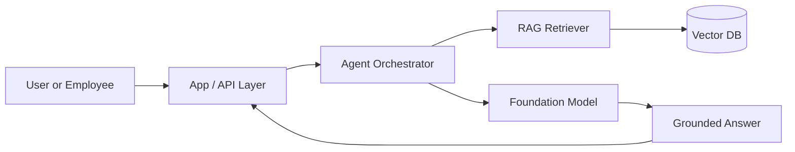

# Enterprise AI Engineering Playbook

A practical, leadership-oriented repository for understanding how to design, build, secure, and operate enterprise AI systems. This playbook focuses on production readiness rather than toy demos.

## What this repository covers
- AI SDLC and delivery practices
- MCP examples for tool integration
- RAG and retrieval architecture
- Agent orchestration patterns
- Security, governance, and responsible AI
- Architecture diagrams and sample prompts

## Repository structure
- `docs/` – architecture, roadmap, and reference documentation
- `examples/` – runnable examples and starter code
- `prompts/` – reusable prompts for analysis and implementation
- `AI_SDLC.md` – lifecycle guidance for AI systems
- `MCP_GUIDE.md` – Model Context Protocol overview and examples
- `SECURITY.md` – enterprise security and governance guidance

## Architecture snapshot

## Documentation
- [Architecture overview](docs/architecture.md)
- [Roadmap](docs/roadmap.md)
- [AI SDLC](AI_SDLC.md)
- [MCP guide](MCP_GUIDE.md)
- [Security guide](SECURITY.md)

## Setup
1. Clone the repository.
2. Review the documentation in `docs/`.
3. Run the example scripts in `examples/`.
4. Adapt the sample prompts in `prompts/` for your use case.

## Roadmap
See [docs/roadmap.md](docs/roadmap.md) for planned additions.

## Why this matters
This repository is designed to communicate a senior-level perspective: enterprise AI is not just about model calls, but about reliable delivery, governance, and operational maturity.

