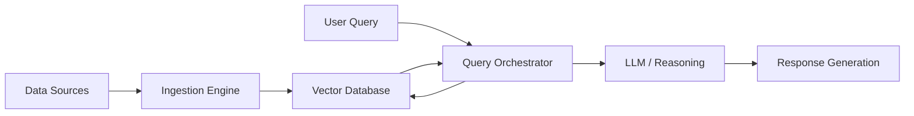

# Enterprise AI Engineering Playbook

A comprehensive guide and reference architecture for building production-grade AI systems using LLMs, RAG, and Agentic workflows.

## 🏗 Architecture

### RAG Pipeline

## 🛠 Features
- **AI SDLC**: Best practices for versioning models and data.
- **MCP Examples**: Model Context Protocol implementations for tool integration.
- **Agent Orchestration**: Multi-agent patterns for complex task solving.
- **Security**: Prompt injection mitigation and PII masking.

## 🚀 Setup Guide
1. Clone the repo.
2. Run `pip install -r requirements.txt`.
3. Configure your `.env` with API keys.

## 📜 License
MIT
