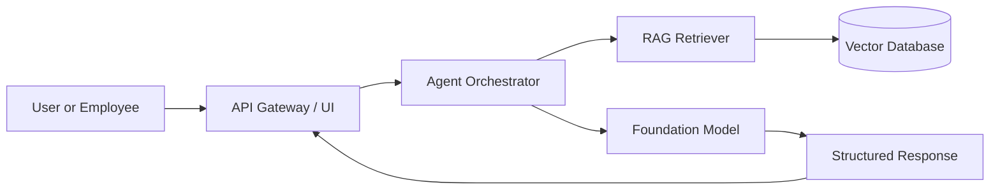
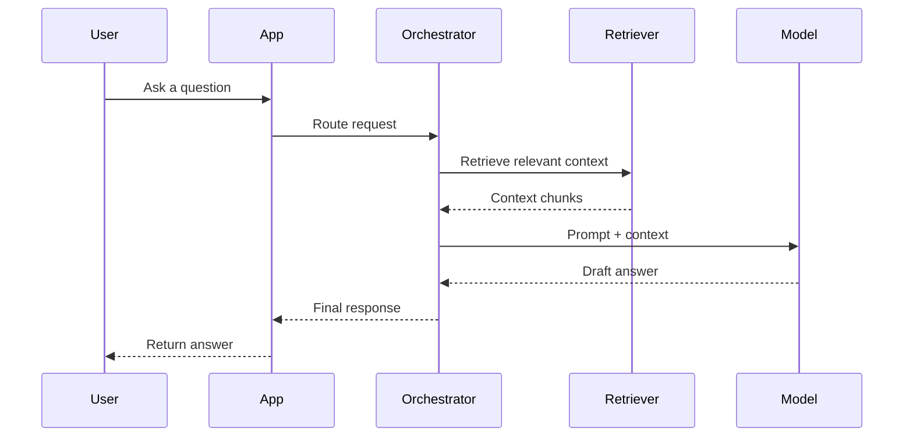

# Architecture Overview

This repository outlines a practical enterprise AI architecture for building trustworthy, production-ready assistants and agents.

## High-level architecture

## Sequence flow

## Design principles

- Keep data access governed and auditable.
- Separate retrieval, orchestration, and model execution concerns.
- Add guardrails for security, privacy, and grounding.
- Ensure human oversight for high-impact decisions.
